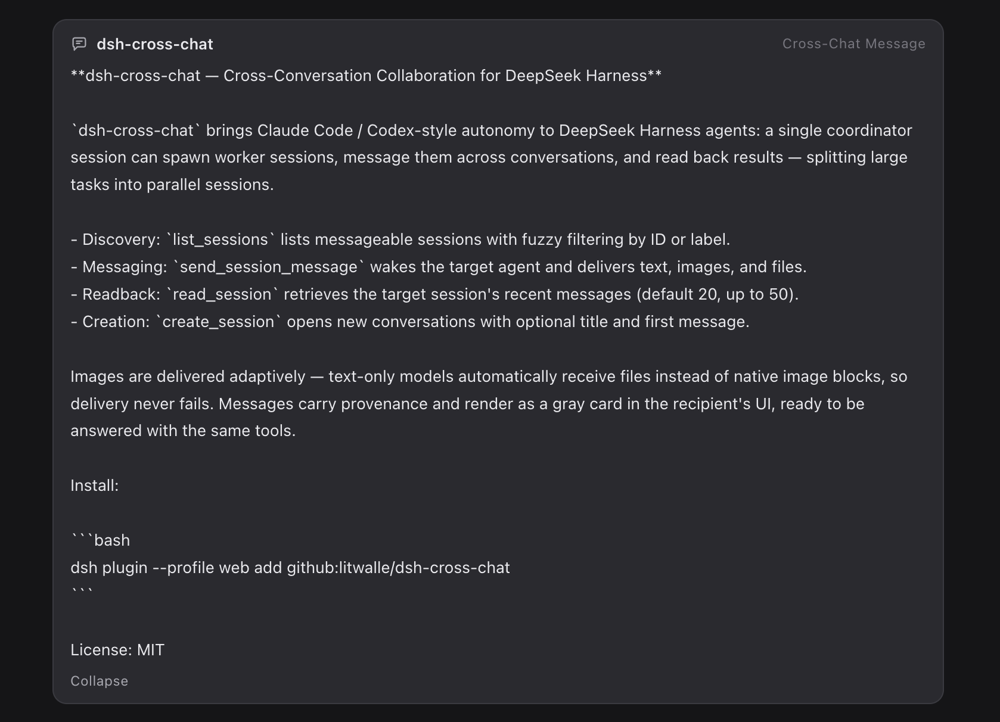

# dsh-cross-chat

**English** · [中文](./README.zh-CN.md)

**Give DeepSeek Harness agents Claude Code / Codex-style autonomy — one coordinator session, many parallel worker sessions.**




`dsh-cross-chat` brings Claude Code / Codex-style autonomy to DeepSeek Harness agents: a single **coordinator** session spawns **worker** sessions, messages them across conversations, and reads back their results — splitting a large task into parallel sessions.

## Capabilities

| Tool | What it does |
|---|---|
| `list_sessions` | List messageable sessions with fuzzy filtering by id or label |
| `send_session_message` | Deliver a message to another session and wake its agent (queues when busy); supports images and files |
| `read_session` | Read the target session's recent user/assistant messages (default 20, max 50) |
| `create_session` | Create a new top-level conversation (the GUI "+" path) with optional title and first message; auto-attaches to the cwd's workspace group when one is registered |

**Adaptive image delivery** — image capability is probed before sending: vision-capable models receive native image blocks; text-only models automatically receive the image as a workspace file with a path note. Delivery never fails.

**Full round-trip** — delivered messages carry provenance and render as a gray card in the receiver's GUI, ready to be answered with the same tools.

## Install

One command, the official DSH plugin way (`dsh plugin` forwards to pnpm in your profile):

```bash
dsh plugin --profile web add dsh-cross-chat@latest
```

From GitHub, or pinned to a release tag:

```bash
dsh plugin --profile web add github:litwalle/dsh-cross-chat
dsh plugin --profile web add github:litwalle/dsh-cross-chat#v1.1.2
```

Then restart `dsh web`.

The built `lib/` output is committed to this repo, so install-from-Git works without a build step. To build from source: `pnpm install && pnpm run build`.

## Configuration

Overridable in your profile's `cordis.patch.yml`:

| Key | Default | Notes |
|---|---|---|
| `attribution` | `'prefix'` | Prepends `[跨会话消息 · 来自 <name>]` to the message body; `'none'` disables |
| `maxMessageChars` | `4000` | Max characters per message |
| `maxReadMessages` | `50` | Max `limit` for `read_session` |

## Limitations

- Only live sessions in the same process (conversations open in the current Web GUI) are discoverable.
- Text-only models receive images as workspace files with a path note; the receiver needs vision/file tools to actually "see" them.

## License

MIT
