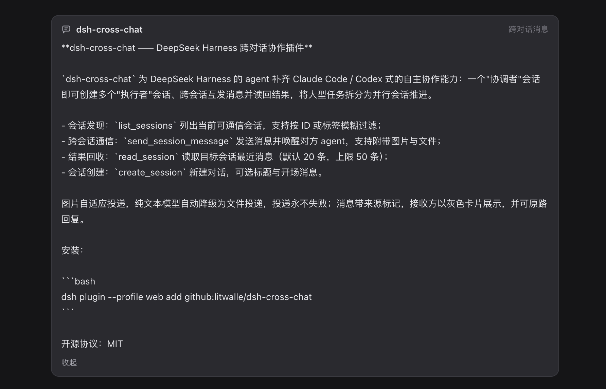

# dsh-cross-chat

**让 DeepSeek Harness 的 agent 拥有 Claude Code / Codex 式的自主协作能力——一个"协调者"会话，多个并行的"执行者"会话。**




`dsh-cross-chat` 为 DeepSeek Harness 的 agent 补齐 Claude Code / Codex 式的自主协作能力：一个"协调者"会话即可创建多个"执行者"会话、跨会话互发消息并读回结果，将大型任务拆分为并行会话推进。

## 能力

| 工具 | 作用 |
|---|---|
| `list_sessions` | 列出当前可通信会话，支持按 ID 或标签模糊过滤 |
| `send_session_message` | 发送消息并唤醒对方 agent（目标忙则排队），支持附带图片与文件 |
| `read_session` | 读取目标会话最近消息（默认 20 条，上限 50 条） |
| `create_session` | 新建对话，可选标题与开场消息；cwd 属于已注册工作区时自动挂入对应分组 |

**图片自适应投递**——发送前先探测目标模型能力：支持图片输入的模型收到原生图片；纯文本模型自动降级为文件投递（写入对方工作区并附路径说明）。投递永不失败。

**收发闭环**——消息带来源标记，接收方以灰色卡片展示，并可原路回复。

## 安装

一条命令，走 DSH 官方插件通道（`dsh plugin` 会在你的 profile 里转发给 pnpm）：

```bash
dsh plugin --profile web add @dsh-external/dsh-cross-chat@latest
```

从 GitHub 安装，或固定版本：

```bash
dsh plugin --profile web add github:litwalle/dsh-cross-chat
dsh plugin --profile web add github:litwalle/dsh-cross-chat#v1.1.1
```

然后重启 `dsh web`。

本仓库已提交构建产物 `lib/`，从 Git 安装无需构建步骤。如要从源码构建：`pnpm install && pnpm run build`。

## 配置

可在 profile 的 `cordis.patch.yml` 中覆盖：

| Key | 默认值 | 说明 |
|---|---|---|
| `attribution` | `'prefix'` | 正文前加 `[跨会话消息 · 来自 <名称>]`；`'none'` 关闭 |
| `maxMessageChars` | `4000` | 单条消息字符上限 |
| `maxReadMessages` | `50` | `read_session` 的 `limit` 上限 |

## 已知限制

- 仅能发现同一进程内活着的会话（当前 Web GUI 中打开的对话）。
- 纯文本模型收到的是工作区文件 + 路径说明，需要对方有视觉/文件工具才能真正"看到"图片。

## License

MIT

---

[English](./README.md) · [中文](./README.zh-CN.md)
